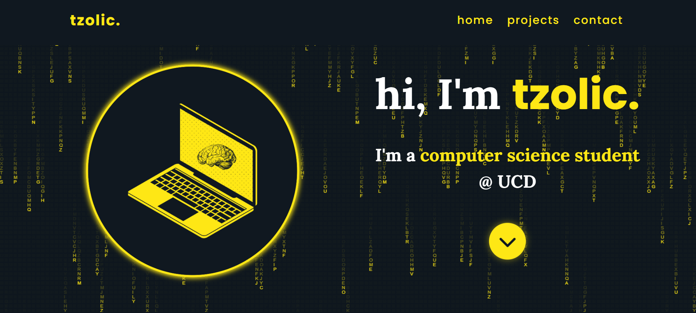
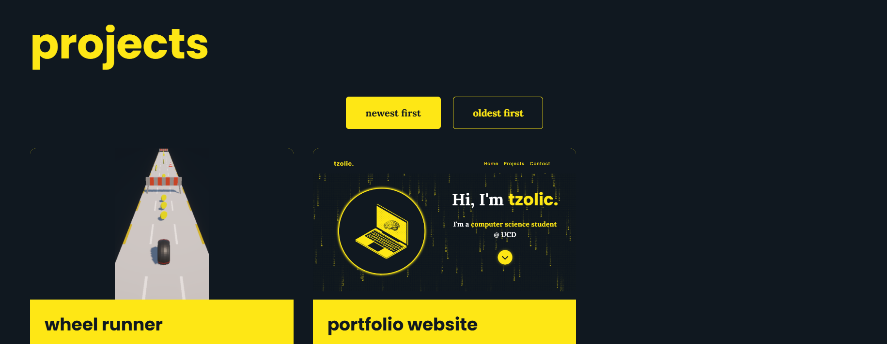
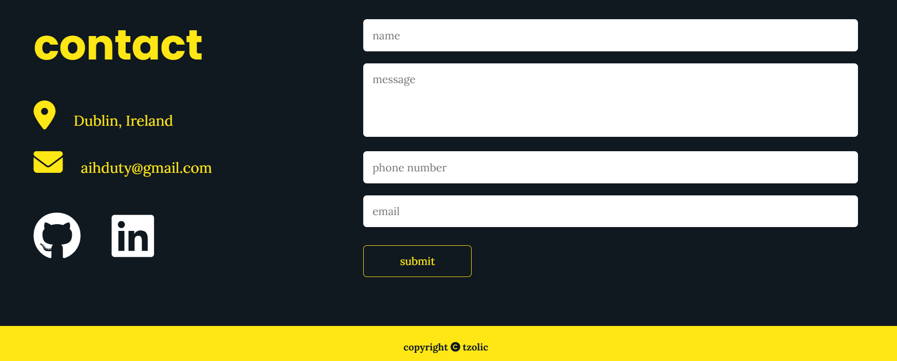

# Portfolio Website: A Minimalist Scalable Responsive Portfolio Website To Showcase Projects

## Preview





## View Project

### Click here: [tzolic.netlify.app](http://tzolic.netlify.app)

## Tools Used

- Frontend: CSS, JavaScript, HTML
- Backend: Google Apps Script
- Database: Google Sheets, JSON

## Goal(s): Why Did I Build This?

- Showcase my projects in computer science
- Establish a professional online presence

## Target Audience(s): For Who Did I Build This?

- Prospective employers and clients in the computer science industry
- Developers looking to build a portfolio website for themselves
- Developers who already have a portfolio and are looking for some design inspiration or code snippets
- People interested in my work

## Key Features

- Integrated a JSON file with HTML using Javascript to load projects, ensuring scalability and simplicity for project updates
- Integrated the contact form with Google Sheets using Google Apps Script to store real-time data during contact form submissions and automatically receive an email notification for each new entry
- Incorporated a matrix rain animation effect using JavaScript to visually enhance the landing page UX design

## How To Install This?

- Clone the repository
- Open `index.html` in your browser

## How To Use This?

- Modify `index.html` and `style.css` to reflect your personal branding
- Update `projects.json` with your own projects
- Connect a Google Sheet to the portfolio website for realtime data storage and automatic email notification for each new contact form submissions
- Create a Google Sheet
- Rename the sheet (the title doesn't really matter) to `portfolio contact`
- Name the header of your sheets by filling up the first row with names that matches the `name` identifier in `index.html`

```html
<input type="text" name="name" placeholder="Name" required>
<textarea name="message" rows="4" placeholder="Message" required style="resize: none;"></textarea>
<input type="tel" name="phone" placeholder="Phone Number" pattern="^\+?\d{1,15}$" required>
<input type="email" name="email" placeholder="Email" pattern="[a-zA-Z0-9._%+-]+@[a-zA-Z0-9.-]+\.[a-zA-Z]{2,}" required>
```

For example here my name attributes are:

- `name`
- `message`
- `phone`
- `email`

So they must be the name of the headers of my google sheet

- Go to `Extensions` > `Google Apps Script`
- Copy and paste this code

```jsx
var sheetName = 'portfolio contact';
var scriptProp = PropertiesService.getScriptProperties();

function initialSetup() {
  var activeSpreadsheet = SpreadsheetApp.getActiveSpreadsheet();
  scriptProp.setProperty('key', activeSpreadsheet.getId());
}

function doPost(e) {
  var lock = LockService.getScriptLock();
  lock.tryLock(10000);

  try {
    var doc = SpreadsheetApp.openById(scriptProp.getProperty('key'));
    var sheet = doc.getSheetByName(sheetName);

    var headers = sheet.getRange(1, 1, 1, sheet.getLastColumn()).getValues()[0];
    var nextRow = sheet.getLastRow() + 1;

    var newRow = headers.map(function(header) {
      return header === 'timestamp' ? new Date() : e.parameter[header];
    });

    sheet.getRange(nextRow, 1, 1, newRow.length).setValues([newRow]);

    //send Email Notification
    var recipient = "aihduty@gmail.com";  // change to your email
    var subject = "new contact form submission";
    var body = "you received a new message:\n\n" +
               "name: " + e.parameter["name"] + "\n" +
               "message: " + e.parameter["message"] + "\n" +
               "phone: " + e.parameter["phone"] + "\n" +
               "email: " + e.parameter["email"];

    MailApp.sendEmail(recipient, subject, body);

    return ContentService
      .createTextOutput(JSON.stringify({ 'result': 'success', 'row': nextRow }))
      .setMimeType(ContentService.MimeType.JSON);
  }
  catch (error) {
    return ContentService
      .createTextOutput(JSON.stringify({ 'result': 'error', 'error': error }))
      .setMimeType(ContentService.MimeType.JSON);
  }
  finally {
    lock.releaseLock();
  }
}
```

- Click on `Deploy` > `New Deployment`
- Go on `Who has access` and choose `Anyone`
- Click on `Deploy` and copy the web app URL
- Paste the web app URL in `script.js`

```jsx
const scriptURL = 'your script url'
```

- Test submitting a contact form on the portfolio website and see if it fills up a row (if it does, you're done)

## License

### Click here: [MIT](LICENSE)

## Source(s)

https://www.youtube.com/watch?v=0YFrGy_mzjY&t=6662s